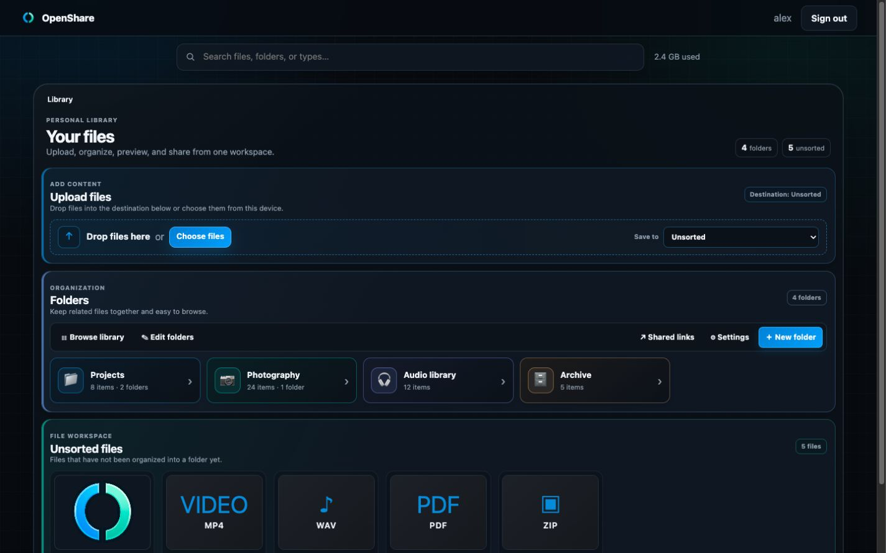
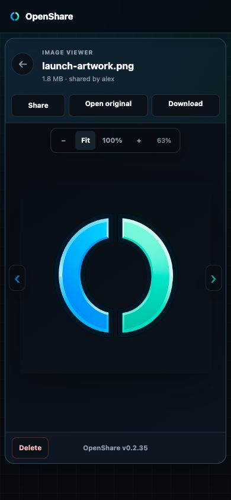
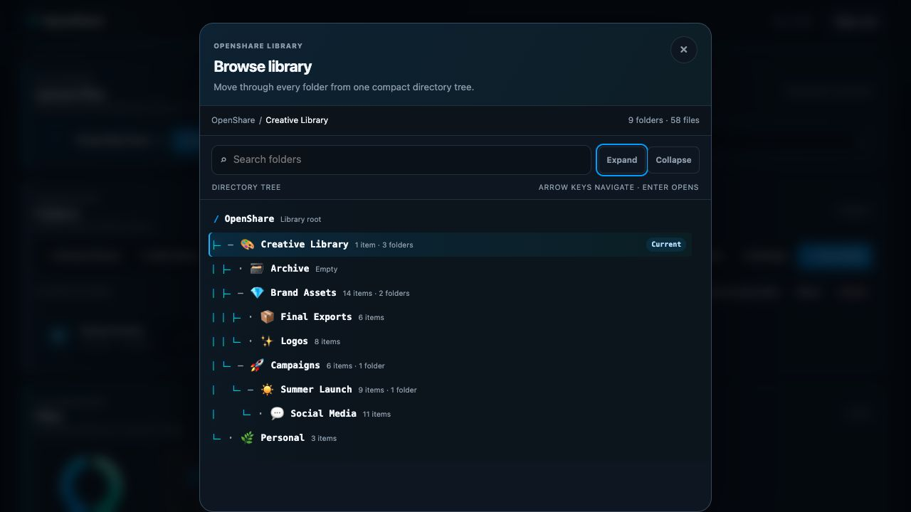

<p align="center">
  
</p>

# OpenShare

A self-hosted file & media service: upload, store, view, and share files behind your own
OpenID Connect login. It provides in-browser viewers, automatic thumbnails, folders, and clean
share links — and doubles as the upload/attachment backend for
**[OpenChat](https://github.com/MinionEnjoyer/OpenChat)**.

## Screenshots

### Desktop folder workspace



### Mobile file viewer

<p align="center">
  
</p>

### Directory tree



## Support

If OpenShare is useful to you, project support is available through
[Buy Me a Coffee](https://buymeacoffee.com/minionenjoyer).

## Features

- **Unified React viewers** for images, video, audio waveforms, PDFs, spreadsheets, text/code,
  archives, and rendered 3D models. Spreadsheet previews support Excel (`.xlsx`, `.xlsm`, `.xls`,
  `.xlsb`), OpenDocument (`.ods`), CSV, and TSV workbooks with sheet tabs, bounded row paging,
  sticky headings, and direct access to the original file. Every viewer shares the same responsive
  modal shell, loading and recovery
  states, owner actions, centered version footer, and recorded sharing workflow. Images add fit,
  actual-size, zoom, and pan controls.
- **Automatic thumbnails** for images, video frames, PDFs, and 3D models; audio uploads get a
  stored **waveform** (audio-level peaks) + duration, served at `/waveform/<id>`.
- **Content-hash de-duplication** — the same file uploaded twice is stored once.
- **Quick paste** — paste large clipboard text into the upload workspace, choose the normal folder
  destination, and optionally create and copy a recorded share link in one step. Pasted text uses
  the same owner-scoped storage, viewer, search, and “My shared links” workflow as any other file.
- **Folders** with nesting, bulk actions, a compact searchable directory tree with persistent
  expansion state and keyboard navigation, custom RGB colors, the full locally bundled OpenChat
  emoji picker, a focused edit mode, and optional dynamic or user-selected image covers
  (icon-only by default). The upload surface remains above the folder workspace at every viewport
  size.
- **Recorded share links** — create, copy, review, and revoke links from “My shared links,” or add
  an existing owned `/f/<id>` folder link without changing the URL already shared. Stable
  `/(i|v|au|d|t|m|a|ss)/<id>` viewer URLs also expose `/raw` and `/thumb` for direct bytes. Media
  viewers create revocable `/ms/<id>` links recorded beside folder shares.
- **Progressive library search** that surfaces matching folders and files as the user types, with
  direct navigation to each result and a clear path to the complete owner-scoped result set.
- **Private contact manager** with owner-scoped search, color-coded groups, rich contact details,
  notes, birthdays, vCard/CSV import, vCard export, and optional OpenChat username or 8-digit friend
  code links. OpenShare never sends unrelated contact fields to OpenChat. See
  [Contacts and spreadsheets](docs/CONTACTS_AND_SPREADSHEETS.md) for usage, privacy boundaries,
  formats, and APIs.
- **Structured library workspace** with distinct upload, folder, and unsorted-file areas, balanced
  card spacing, responsive controls, and consistent empty, loading, and error states.
- **Companion collections** — when OpenChat is configured, its attachments, stickers, avatars,
  and soundboard assets appear in a dedicated OpenChat tab beside “My shared links.” They never
  create or clutter the user's personal folder tree.
- **Per-browser preferences** for light, dark, or system appearance, comfortable or compact folder
  density, reduced animation, and delete confirmation.
- **Consistent loading feedback** using the concentric OpenChat blue-and-green spinner for uploads,
  media loading, and React workspace requests.
- **SSO** via any OpenID Connect provider (Authentik, Keycloak, …); sessions are cookie-based.
- **Embeds anywhere** — set `ALLOWED_ORIGINS` so a trusted client (e.g. your OpenChat) can upload
  with credentials and render Share links inline.

## Tech

FastAPI (Python 3.12) · React 18 / TypeScript · SQLite · Authlib (OIDC) · Calamine spreadsheet
parsing · Pillow / ffmpeg / poppler / pyrender for thumbnails. React owns the signed-in library,
progressive search, contacts, public
folder presentation, and every media viewer. FastAPI supplies thin metadata shells plus
authentication, storage, and stable resource URLs. Ships as one image.

The current OpenShare release is **0.2.41**. The canonical value lives in [`VERSION`](VERSION), is
shown in the web footer, and is returned by `GET /health` so operators can verify the active build.

## Quick start

```bash
cp .env.example .env      # fill in every CHANGE_ME (see below)
docker compose up -d --build
```

OpenShare listens on `PORT` (default `8800`). Put it behind a reverse proxy that terminates TLS
and set `PUBLIC_URL` to the public HTTPS URL. Upload limits are opt-in, so configure the reverse
proxy with no request-body ceiling (for nginx, `client_max_body_size 0`) or with a ceiling at least
as large as your chosen `UPLOAD_MAX_MB` / `UPLOAD_TOTAL_MAX_MB`. A lower proxy ceiling returns 413
before OpenShare can apply its configured policy.

### Public container

Release images for AMD64 and ARM64 are published to the GitHub Container Registry after the exact
`main` commit passes CI. A configured Docker Hub mirror receives the exact verified image digest
and the same `latest`, version, and `sha-<commit>` tags. Copy `.env.example` to `.env`, configure
it, and start the published image:

```bash
docker compose -f docker-compose.public.yml pull
docker compose -f docker-compose.public.yml up -d
```

The Compose file defaults to `ghcr.io/minionenjoyer/openshare:latest`. Set
`OPENSHARE_VERSION=0.2.41` to pin this release, or use the published `sha-<commit>` tag for an
immutable deployment. Set `OPENSHARE_IMAGE=<namespace>/openshare` to pull the Docker Hub mirror.
Source builds remain available through the standard `docker-compose.yml`.

The Docker Hub overview is maintained in `docs/dockerhub/openshare.md` and synchronized by the same
CI-gated publication workflow, including its short description and deployment guidance.

Maintainers enable Docker Hub publishing with `DOCKERHUB_USERNAME` and `DOCKERHUB_NAMESPACE`
repository variables and a `DOCKERHUB_TOKEN` repository secret. The token should be a dedicated
Docker Hub personal or organization access token with read/write permission for the public
`openshare` repository. If those settings are absent, the release remains GHCR-only and does not
fail.

### Configuration

Everything is environment-driven via `.env` (the one local, gitignored config file):

| Variable | What it is |
|---|---|
| `SESSION_SECRET` | Cookie signing key — `openssl rand -base64 48` |
| `OIDC_CLIENT_ID` / `OIDC_CLIENT_SECRET` / `OIDC_ISSUER` | Your OIDC app credentials + issuer URL |
| `PUBLIC_URL` | Public base URL (used for OIDC redirect + share links) |
| `ALLOWED_ORIGINS` | Comma-separated trusted application origins (e.g. your OpenChat URL) |
| `SHARE_API_KEY` | Shared secret scoped to OpenChat upload and waveform requests; other owner operations always require an OpenShare session |
| `OPENCHAT_PUBLIC_URL` | Optional companion URL used by contact cards to open OpenChat with a linked username or friend code |
| `FEDERATION_ENABLED` | Opt in to private, signed attachment replication; disabled by default |
| `FEDERATION_NODE_ID` / `FEDERATION_SHARED_SECRET` / `FEDERATION_PEERS` | Unique node identity, 32+ character cluster key, and explicit JSON list of HTTPS OpenShare peers |
| `STORAGE_ROOT` | In-container path for files/thumbnails (matches the compose mount) |
| `STORAGE_PATH` | Host path bind-mounted for storage — point at a big disk or NAS |
| `PORT` | Host port to expose |
| `FORWARDED_ALLOW_IPS` | Reverse-proxy IPs/CIDRs trusted for forwarded headers (default `127.0.0.1`) |
| `DATABASE_FILE` | SQLite file inside the container (default `/data/gallery.db`) |
| `UPLOAD_MAX_FILES`, `UPLOAD_MAX_MB`, `UPLOAD_TOTAL_MAX_MB` | Optional operator upload limits; unset means unlimited |
| `ARCHIVE_MAX_MB`, `ARCHIVE_EXPANDED_MAX_MB`, `ARCHIVE_MAX_ENTRIES` | Optional archive safety limits; unset means unlimited |
| `WAVEFORM_MAX_MB`, `PROCESSING_MAX_CONCURRENCY`, `PROCESSING_TIMEOUT_SECONDS` | Optional media-processing limits; unset means unlimited |

Your OIDC provider needs an application for OpenShare whose redirect URI is
`‹PUBLIC_URL›/auth/callback`.

## Using OpenShare as OpenChat's file backend

The pair is designed to run together:

1. Deploy OpenShare and note its `PUBLIC_URL` (e.g. `https://share.example.com`).
2. In OpenShare's `.env`, add your OpenChat origin to `ALLOWED_ORIGINS`
   (e.g. `https://chat.example.com`), set `OPENCHAT_PUBLIC_URL` to that address, and set
   `SHARE_API_KEY` to a random secret.
3. In OpenChat's `.env`, set `SHARE_BASE_URL` to OpenShare's `PUBLIC_URL` and `SHARE_API_KEY`
   to the **same** secret from step 2.

OpenChat's API uploads and requests waveform analysis on the user's behalf using that shared key
(so it works even for users who've never opened OpenShare), while browsers render public share
assets directly. OpenShare also accepts the same key on the legacy `/api/assets` upload route so
already-released OpenChat servers can migrate without enabling a development login. Both apps share the same
OIDC provider, so a logged-in user is authorized to both. OpenChat also runs fine **without**
OpenShare — it simply hides file/image uploads.

When the companion key is enabled, OpenShare classifies service-key uploads as OpenChat content.
The web library exposes that logical collection beside “My shared links,” while normal uploads
remain in the personal library. Upgrading from an older release migrates assets from the former
top-level `Chat` folder into this collection and removes that folder when it is empty. Identical
historical OpenChat uploads are grouped by content hash in the companion view while every original
asset ID remains valid for existing messages.

Contacts can optionally store an OpenChat username and 8-digit friend code. When
`OPENCHAT_PUBLIC_URL` is configured, the contact detail view offers a deliberate “Open OpenChat”
action and a separate copy-code action. The integration does not upload addresses, phone numbers,
notes, or other private contact data.

## Storage layout

- Uploaded files + thumbnails live under `STORAGE_ROOT` (bind-mounted from `STORAGE_PATH`).
- File metadata (owners, folders, hashes) lives in a small SQLite DB on the `openshare_data` volume.

Both persist across rebuilds; neither is ever committed to git.

## Trusted mirror cluster

OpenShare can mirror normal uploaded assets across the OpenShare nodes backing a private OpenChat reliability cluster. There is no public discovery or global network: replication starts only when `FEDERATION_ENABLED=1`, every request must come from an explicitly configured HTTPS peer, and payloads are authenticated with `FEDERATION_SHARED_SECRET`.

Transfers are content-digest verified and idempotent. Each outgoing asset is written to the SQLite event ledger and one durable delivery row per peer before transmission; failures retry with bounded backoff. Configure a full mesh so every node lists every other node. The associated OpenChat nodes use the same configuration pattern described in OpenChat's `docs/TRUSTED_MIRROR_CLUSTER.md`.

The current asset path covers ordinary files used for OpenChat attachments, avatars, stickers, and soundboard entries. Multi-file 3D bundles remain local because they are directory trees rather than a single content-addressed object.

## CI-gated automatic deployment

The optional systemd scaffold in `ops/systemd/` polls `main` every five minutes and deploys only
when the GitHub Actions workflow named `CI` has succeeded for that exact commit. Each build is
checked out into an immutable release directory, and `/health` must report the release's exact
`VERSION` before the active pointer advances. Failed builds retain the previous pointer and trigger
an application rollback attempt.

For immutable releases, `DB_PATH` and `STORAGE_PATH` in the protected production `.env` must be
absolute host paths. The deployer refuses to start otherwise, preventing a new release directory
from silently creating a fresh database or storage tree.

On the deployment host, install the protected configuration and units once:

```bash
sudo install -d -m 0750 /etc/openshare /opt/openshare-deployer /opt/openshare-releases
sudo install -m 0640 .env /etc/openshare/.env
sudo install -m 0640 ops/systemd/deploy.conf.example /etc/openshare/deploy.conf
sudo install -m 0755 ops/systemd/openshare-autodeploy.sh /usr/local/sbin/openshare-autodeploy
sudo install -m 0644 ops/systemd/openshare-autodeploy.service /etc/systemd/system/
sudo install -m 0644 ops/systemd/openshare-autodeploy.timer /etc/systemd/system/
sudo systemctl daemon-reload
sudo systemctl enable --now openshare-autodeploy.timer
```

Confirm candidate resolution without changing the running stack:

```bash
sudo systemctl stop openshare-autodeploy.timer
sudo bash -c 'set -a; . /etc/openshare/deploy.conf; exec /usr/local/sbin/openshare-autodeploy --check'
sudo systemctl start openshare-autodeploy.timer
```

## Testing

The test harness runs entirely in-process. It creates a fresh SQLite database and storage tree
for every integration test, supplies deterministic media processors, and never contacts OIDC,
ffmpeg, OpenChat, or a deployed OpenShare instance.

```bash
python -m venv .venv
. .venv/bin/activate
pip install -r requirements-dev.txt
npm --prefix web ci
make test            # complete suite
make test-unit       # fast classification/configuration checks
make test-integration
make test-cov        # branch coverage + coverage.xml
make verify          # Python/React tests, builds, coverage, deploy checks, and dependency audit
```

CI also builds the production Docker image and imports the application inside it. This smoke check
prevents a release from passing when a locally imported module is missing from the image.

See [`tests/README.md`](tests/README.md) for fixtures, request identities, and examples.
